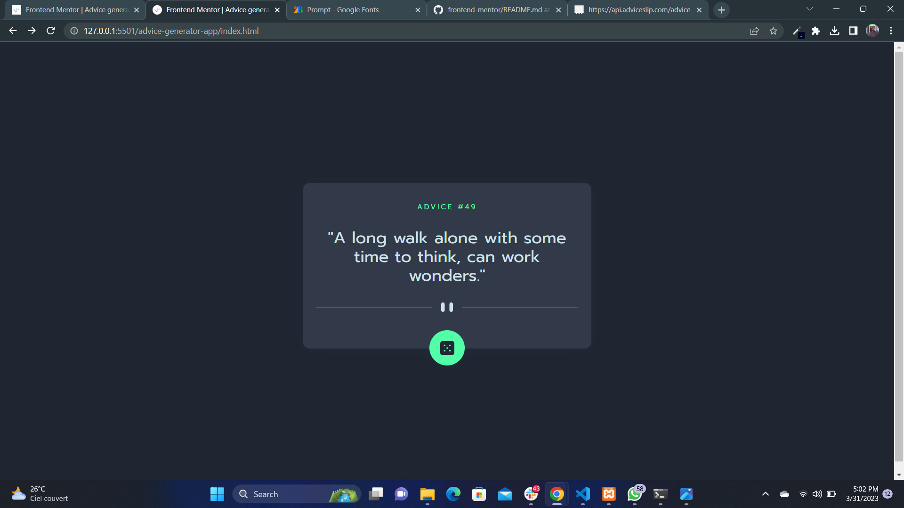

# Frontend Mentor - QR code component solution

This is a solution to the [Advice generator app challenge on Frontend Mentor](https://www.frontendmentor.io/challenges/advice-generator-app-QdUG-13db). Frontend Mentor challenges help you improve your coding skills by building realistic projects.

## Table of contents

- [Overview](#overview)
  - [Screenshot](#screenshot)
  - [Links](#links)
- [My process](#my-process)
  - [Built with](#built-with)
  - [What I learned](#what-i-learned)
- [Author](#author)

## Overview

### Screenshot



### Links

- Solution URL: [https://github.com/Joseph-Jnr/frontend-mentor/tree/main/advice-generator-app](https://github.com/Joseph-Jnr/frontend-mentor/tree/main/advice-generator-app)
- Live Site URL: [https://joseph-jnr.github.io/frontend-mentor/advice-generator-app/](https://joseph-jnr.github.io/frontend-mentor/advice-generator-app/)

## My process

### Built with

- Semantic HTML5 markup
- CSS custom properties
- Flexbox
- Mobile-first workflow
- Javascript

### What I learned

I learned about fetch api and how to populate an element with data from an API.

```js
fetch('https://api.adviceslip.com/advice')
  .then((response) => response.json())
  .then((data) => {
    slipId.textContent = data.slip.id
    slipAdvice.textContent = data.slip.advice
  })
  .catch((error) => console.log(error))
```

## Author

- Frontend Mentor - [@Joseph-Jnr](https://www.frontendmentor.io/profile/Joseph-Jnr)
- Twitter - [@joseph_jnr1](https://www.twitter.com/joseph_jnr1)
