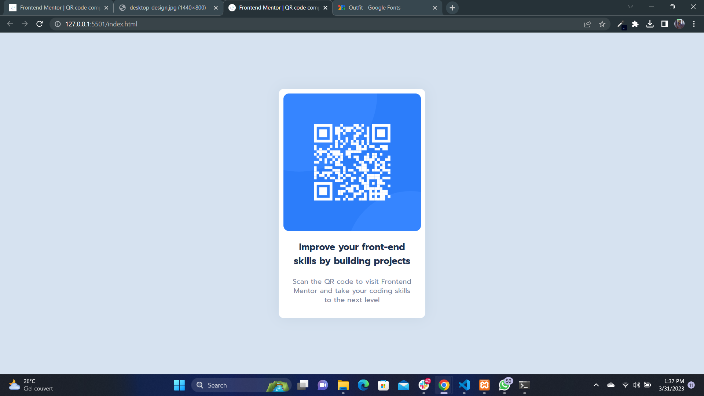

# Frontend Mentor - QR code component solution

This is a solution to the [QR code component challenge on Frontend Mentor](https://www.frontendmentor.io/challenges/qr-code-component-iux_sIO_H). Frontend Mentor challenges help you improve your coding skills by building realistic projects.

## Table of contents

- [Overview](#overview)
  - [Screenshot](#screenshot)
  - [Links](#links)
- [My process](#my-process)
  - [Built with](#built-with)
  - [What I learned](#what-i-learned)
- [Author](#author)

## Overview

### Screenshot



### Links

- Solution URL: [https://github.com/Joseph-Jnr/frontend-mentor/tree/main/qr-code-challenge](https://github.com/Joseph-Jnr/frontend-mentor/tree/main/qr-code-challenge)
- Live Site URL: [https://joseph-jnr.github.io/frontend-mentor/qr-code-challenge/](https://joseph-jnr.github.io/frontend-mentor/qr-code-challenge/)

## My process

### Built with

- Semantic HTML5 markup
- CSS custom properties
- Flexbox
- Mobile-first workflow

### What I learned

I learned css flexbox and how to properly wrap elements.

```css
.qr-code {
  height: 300px;
  overflow: hidden;
  border-radius: 12px;
  position: relative;
}

.qr-code img {
  width: 100%;
  height: 100%;
}
```

## Author

- Frontend Mentor - [@Joseph-Jnr](https://www.frontendmentor.io/profile/Joseph-Jnr)
- Twitter - [@joseph_jnr1](https://www.twitter.com/joseph_jnr1)
